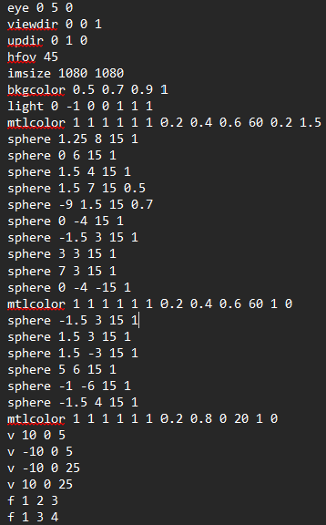
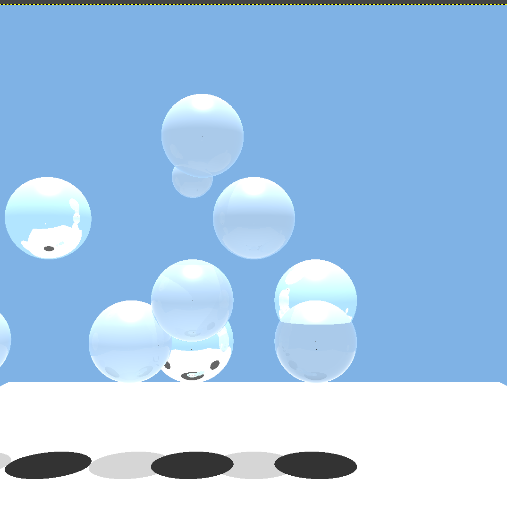

# Ray-Tracer

Computes the color at a ray/surface intersection point using recursive ray tracing with an extended version of the Phong illumination equation that additionally considers:
- Intensity that is specularly reflected to the ray/surface intersection point from other portions of the scene; and
- Intensity from other parts of the scene that is transmitted through the intersected surface, when that surface is transparent.

#### Input file: sample.txt

#### Output file: sample.ppm

